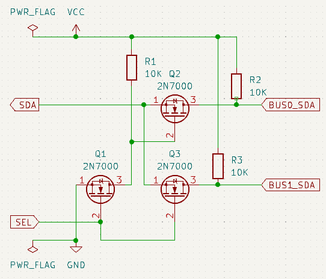

## I2Cx2

Switch between two I2C data (SDA) lines using an additional GPIO pin and MOSFETs

Adapted from [this StackOverflow circuit][so-i2c-multiplex-circuit]
with an added MOSFET as a NOT gate (I used 2N7000 MOSFETs):



Example usage:

```yaml
external_components:
- source: github://smkent/esphome-components
  components: [ i2cx2 ]

i2c:
- id: i2c0
  sda: 8
  scl: 9
  scan: false

i2cx2:
  i2c_id: i2c0
  # Bus selector pin number
  pin: 20
  # true if the first I2C bus needs the selector pin to be HIGH, false otherwise
  first_bus_pin_state: true
  # Always reactivate the first virtual bus after using the second virtual bus
  always_restore_first_bus: true
  virtual_buses:
  - bus_id: i2c0_high
    scan: true
  - bus_id: i2c0_low
    scan: true
```


[so-i2c-multiplex-circuit]: https://electronics.stackexchange.com/a/209031
